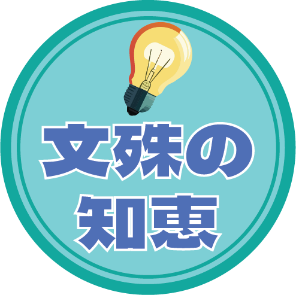
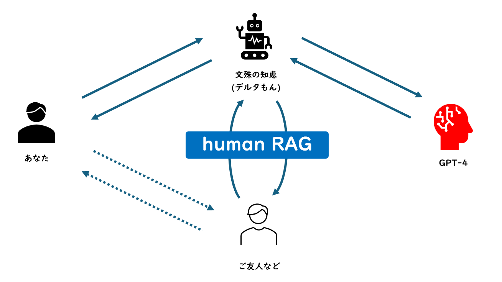

# Monju-no-chie 文殊の知恵

## 概要
- 東京AI祭 2024 ハッカソン 東京AI祭技術大合戦賞に応募するためのプロダクトです。
- メイン部門　③未来　ジャンル　[文殊の知恵](https://app.akindo.io/communities/X4RKdG2Q4hBDMRZV/products/OVqOJwdXWunN31dA) プロダクト
- 通常のRAGでは既存文書に書かれた知識を入れることができますが、このhuman RAGコンセプトでは、第3者である人間の中にしか存在しない人生のストーリーや確固たる意思、その他AIだけでは決して得られることのできない繊細でユニークな考え方などを取り入れることができ、これによりAIの枠を超えた活用が実現できます。

### 何をするのか　What it does

このアプリは、2人の人間と1台のAIが協力し、チャットを通じて卓越したアイデアを生み出したり、複雑な課題を解決したりするためのプラットフォームです。参加者は〇〇もん。と呼ばれ、三人の文殊になりきります。

### 解決する問題　The problem it solves

AIと人間のペアだけでは、発想や問題解決において限界が存在します。しかし、AIの計算能力に第三者の視点や意見を組み合わせることで、従来のAIチャットだけでは難しかった問題や課題に対して、優れたアイデアや強い決意をもって取り組むことが可能になります。

### 遭遇した課題　Challenges I ran into

初めてのハッカソン参加で、右も左もわからない中、
短い期間でマルチエージェントの動作可能なプロダクトまでを構築する必要があったこと。

### 使用した技術　Technologies I used

日本発のXroid Studioというノーコードチャットエージェント開発ツールを利用して短期間で開発。
同じくRoidemiaというアプリ、実行環境にデプロイしていiOS, Android, PCでも動作できるようにした。
バックエンドにはGPT-4を使用している。

### 構築した方法　How we built it

もくもく会で知ったAI専用フリーキャラクター、デルタもんをメインキャラクターに採用。
さらにDiscordのメンバー募集チャンネルを唯一活用し、募集したメンバーとーますさんとチーム
を組んで協力して開発できた。

### 何を学んだか　What we learned

とにかくあきらめない意思を持ち、行動すること。初めてのハッカソンでも何とかやりとげられた。
また、積極的にコミュニティに参加することで、一人では成し遂げられない課題に対し、
縁を生かすことの大切さを学んだ。

### 次に何をする　What's next for

コンテンツの改良・充実。とくに遠隔にいる2ユーザーへの対応。
Roidemiaプラットフォームのオフィシャルコンテンツとしてリリースできるようにしたい。
